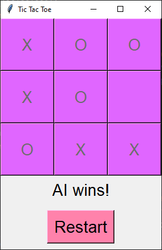

# Tic Tac Toe + AI :robot:
:octocat:
This project is divided into three parts:

## part 1:
[TicTacToe.py](TicTacToe.py) This is the classic two-player game without a GUI. :girl: :woman:

## part 2: 
[TicTacToe-GUI.py](TicTacToe-GUI.py) In this version, I added GUI with Tkinter. :girl: :woman:

## part 3:
[TicTacToe-AI.py](TicTacToe-AI.py) Play against an unbeatable AI opponent, built using the Minimax algorithm. :technologist:

## Minimax Algorithm Introduction
The Minimax algorithm is a decision-making algorithm used in two-player games like Tic Tac Toe to find the optimal move for a player,
assuming the opponent is also playing optimally. The algorithm recursively evaluates all possible moves and their subsequent outcomes to identify the best possible move.
It alternates between minimizing the opponent's score and maximizing the player's score, ensuring the AI makes the most strategic choices.
Since "3x3" Tic-Tac-Toe has a finite, relatively small number of [255,168](http://www.se16.info/hgb/tictactoe.htm) possiblities, a computer can compute each possibility and thus not lose.
